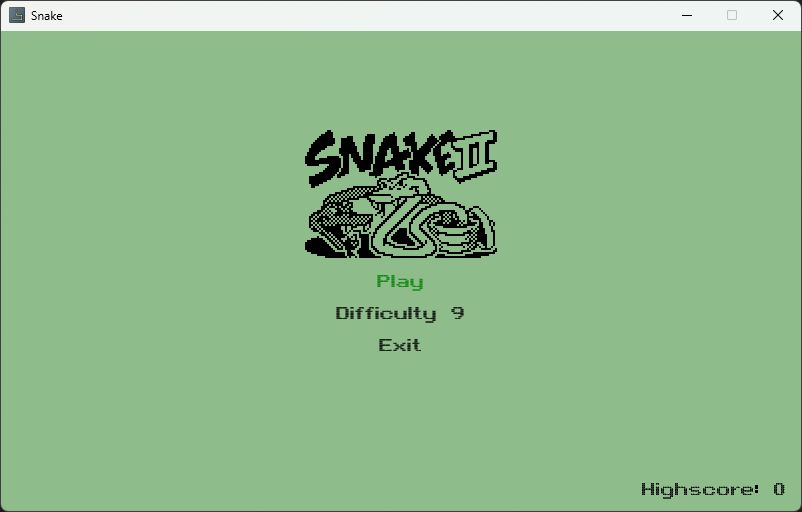
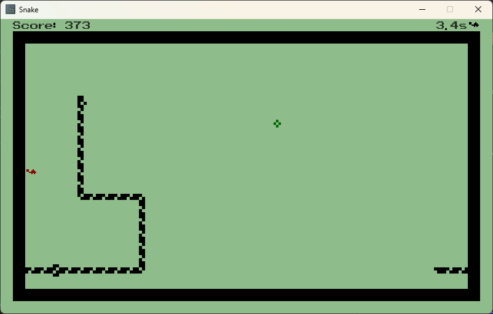

# snake

</img>

Inspired in Nokia's 3310 Snake II game.  

The goal is to make as many points as possible by making the snake eat stuff that shows up.  
The more you eat the longer will the snake grow. If the snake collides with itself the game ends. 

The game is implemented using [MonoGame](https://monogame.net/).
